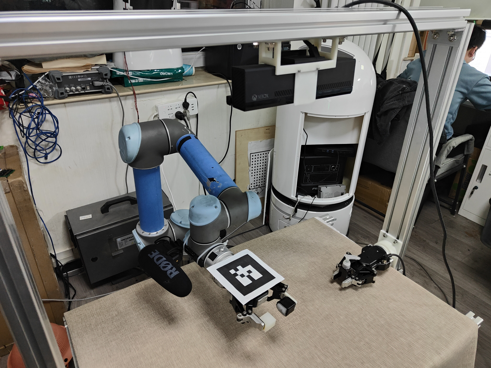
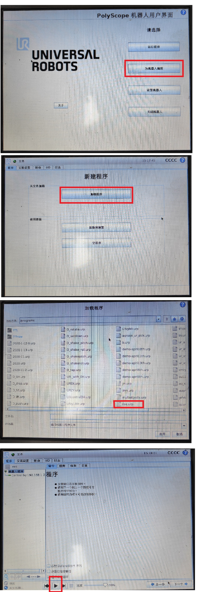
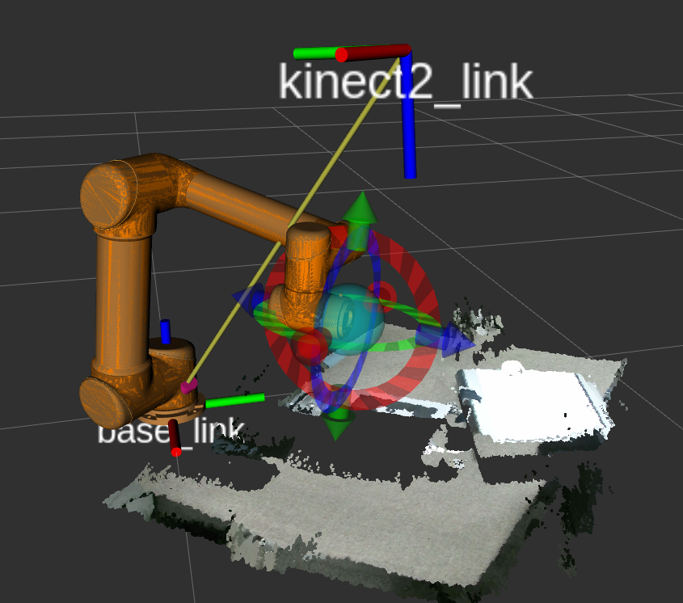

# UR5 Hand-eye Calibration

Automatic hand-eye calibration of the UR5 robotic arm based on the open-source project [easy_handeye](https://github.com/IFL-CAMP/easy_handeye) and ROS. The calibration involves the static Kinect v2 camera installed on the surrounding (eye on base) and the RealSense D435 camera mounted on the ur5 end link (eye on hand). 

## Dependence

1. (Tested) Ubuntu18.04   ros-melodic 

2. UR5 robotic arm, PolyScope firmware3.9 (tested)
   
3. [ar_track_alvar](http://wiki.ros.org/ar_track_alvar/)

4. [kinect v2 related package](https://github.com/code-iai/iai_kinect2.git)

5. [easy_handeye](https://github.com/IFL-CAMP/easy_handeye)

6. Follow [official instruction](https://github.com/UniversalRobots/Universal_Robots_ROS_Driver) to install [Universal_Robots_ROS_Driver](https://github.com/UniversalRobots/Universal_Robots_ROS_Driver) and [fmauch_universal_robot](https://github.com/fmauch/universal_robot) packages.

7. Create a `controllers.yaml` file in path `universal_robot/ur5_moveit_config/config` and write the following: 

   ```yaml
   controller_list:
     - name: ""
       action_ns: /scaled_pos_traj_controller/follow_joint_trajectory
       type: FollowJointTrajectory
       joints:
         - shoulder_pan_joint
         - shoulder_lift_joint
         - elbow_joint
         - wrist_1_joint
         - wrist_2_joint
         - wrist_3_joint
   ```

8. Please check whether the `externalcontrol-1.0.5.urcap` has been installed on the control panel of your UR5, if not, follow the [official instruction](https://github.com/UniversalRobots/Universal_Robots_ROS_Driver/blob/master/ur_robot_driver/doc/install_urcap_cb3.md), configure your UR5 and install `externalcontrol-1.0.5.urcap` and setting your workstation IP. 

9. Extracting robot calibration parameters. These parameters are not obtained from hand-eye calibration and are perceived as a means to characterize and compensate for errors arising from the robotic arm's installation and wear. It is important to distinguish between the two.

   ```bash
   roslaunch ur_calibration calibration_correction.launch \
     robot_ip:=<your_robot_ip>   target_filename:="${HOME}/my_robot_calibration.yaml"
   ```

   

## Install

1. Clone and install.

   ```bash
   cd ~/catkin_ws/src
   git clone https://github.com/Hymwgk/ur5_hand_eye_calibrate.git
   cd ..
   catkin_make
   source ~/catkin_ws/devel/setup.bash
   ```
   
2. After completing all dependency installations and configurations, make sure your `catkin_ws/src` folder has the following structure.
    ```bash
    wgk@wgk:~/catkin_ws/src$ tree -L 1
    .
    ├── CMakeLists.txt -> /opt/ros/melodic/share/catkin/cmake/toplevel.cmake
    ├── easy_handeye
    ├── fmauch_universal_robot
    ├── iai_kinect2
    ├── Universal_Robots_ROS_Driver
    └── ur5_hand_eye_calibrate
    
    5 directories, 1 file
    ```


## Eye on base camera calibration

1. Install the camera and calibration board as shown bellow. The calibration board utilizes a 10cm x 10cm QR code label generated by [ar_track_alvar](http://wiki.ros.org/ar_track_alvar/), with an ID of 7. Ensure that the camera can observe the complete label.

   

   

2. Start the low-level controller, change the IP address to the fixed IP of your UR5 robotic arm, and set the path for the robotic arm calibration parameters to the previously saved path.

   ```bash
   roslaunch ur_robot_driver ur5_bringup.launch robot_ip:=<your_robot_ip> \
     kinematics_config:="${HOME}/my_robot_calibration.yaml"
   ```

3. On the UR5 control panel, launch the program interfaced with ROS. Refer to this [link](https://github.com/UniversalRobots/Universal_Robots_ROS_Driver/blob/master/ur_robot_driver/doc/install_urcap_cb3.md) for instructions. Please note that this operation must be performed after step 2.



4. Start the top-level MoveIt-related ros nodes.

   ```bash
   roslaunch   ur5_hand_eye_calibrate   ur5_moveit_rviz.launch
   ```

5. Start the camera and publish related transformations.

   ```bash
   roslaunch kinect2_bridge kinect2_bridge.launch publish_tf:=true

   ```

6. Start monitor to prevent collisions between the robotic arm and the surrounding environment.

   ```bash
   rosrun kinect2_viewer kinect2_viewer kinect2 sd cloud
   ```

7. Start the hand-eye calibration， please follow the on-screen operation instructions.

   ```bash
   roslaunch ur5_hand_eye_calibrate ur5_eob.launch
   ```


## Eye on hand camera calibration

Here we perform calibration for the RealSense D435 depth camera installed on the robotic arm. 

1. Place the calibration board, identical to the one used for the `eye on base ` calibration, on the desktop, ensuring that the calibration board is within the camera's field of view.


2. Start the low-level controller, change the IP address to the fixed IP of your UR5 robotic arm, and set the path for the robotic arm calibration parameters to the previously saved path.

   ```bash
   roslaunch ur_robot_driver ur5_bringup.launch robot_ip:=192.168.1.110 \
     kinematics_config:="${HOME}/my_robot_calibration.yaml"
   ```

3. On the UR5 control panel, launch the program interfaced with ROS ,following the same steps as for the "eye on base."

   

4. Start the top-level MoveIt-related ros nodes.

   ```bash
   roslaunch   ur5_hand_eye_calibrate   ur5_moveit_rviz.launch
   ```

5. Start the camera and publish related transformations.

   ```bash
   roslaunch realsense2_camera rs_camera.launch
   ```

6. Start the  calibration， please follow the on-screen operation instructions.

   ```bash
   roslaunch ur5_hand_eye_calibrate ur5_eoh.launch
   ```


## Usage

1. Publish the hand-eye pose transformation (eye on base).

   ```bash
   roslaunch ur5_hand_eye_calibrate publish_ur5_eob.launch
   ```
   
2. Or publish the hand-eye pose transformation (eye on hand).

   ```bash
   roslaunch ur5_hand_eye_calibrate publish_ur5_eoh.launch
   ```
   
2. Unlock the UR5 robotic arm and start MoveIt&Rviz.

   ```bash
   roslaunch ur_robot_driver ur5_bringup.launch robot_ip:=192.168.1.110   kinematics_config:="${HOME}/my_robot_calibration.yaml"
   # In another shell.
   roslaunch   ur5_hand_eye_calibrate   ur5_moveit_rviz.launch
   ```

## TroubleShooting

   If there are issues with tf, try restart the MoveIt steps.

## Result


